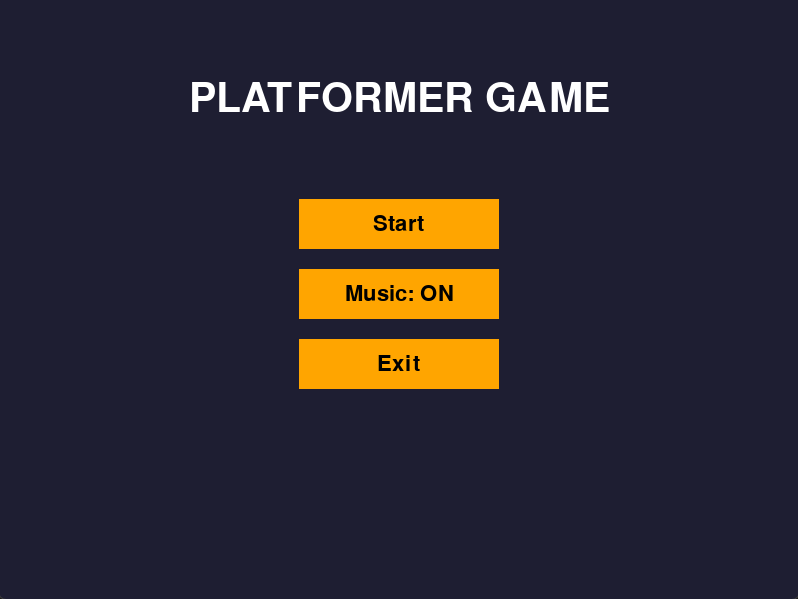
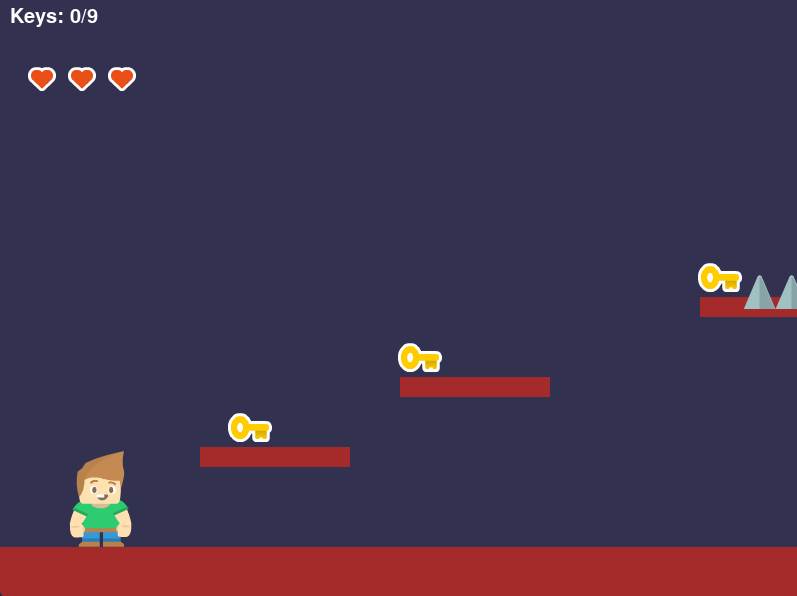
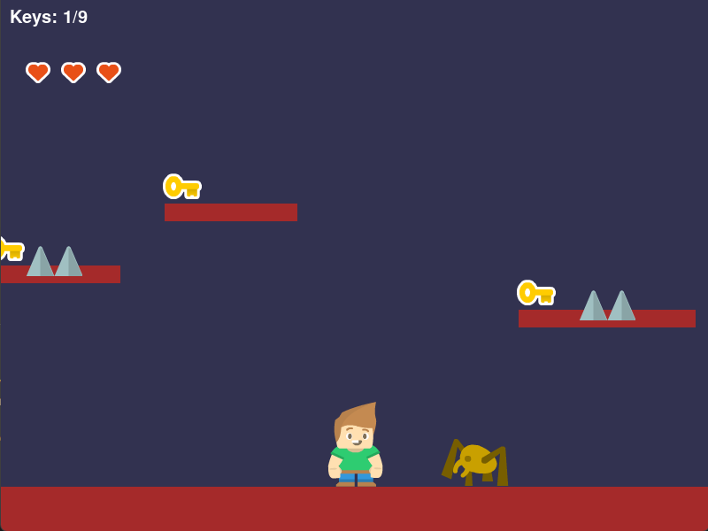
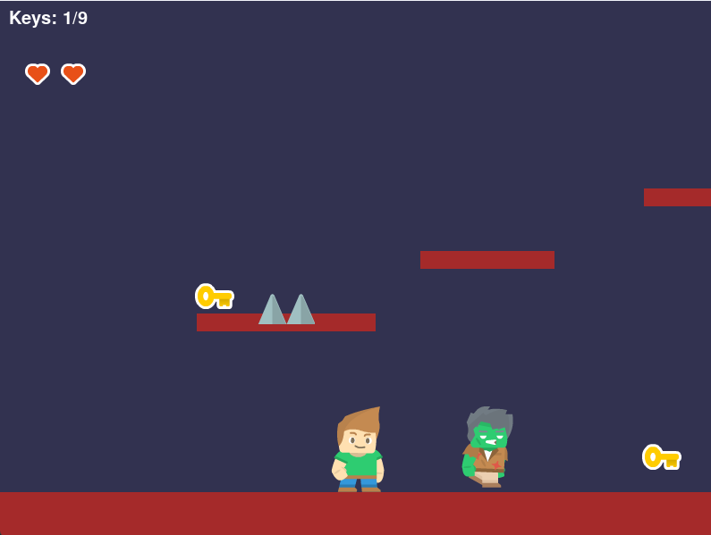

# 🕹️ Plataforma de Jogo com PgZero

Este é um jogo de plataforma desenvolvido com **PgZero (Pygame Zero)**, no estilo arcade clássico 2D. O jogador precisa coletar todas as chaves espalhadas pelo mapa, evitar inimigos e armadilhas, e alcançar a bandeira final para vencer.

## 🎮 Funcionalidades

- Menu interativo com botões de **Iniciar Jogo**, **Ativar/Desativar Música** e **Sair**.
- Personagem principal com animações de andar, pular e ficar parado.
- Sistema de **vidas com corações** (máximo 3).
- **Chaves colecionáveis** que devem ser reunidas para vencer o jogo.
- Inimigos como **zumbis** e **aranhas**, cada um com animações e movimentações próprias.
- **Espinhos** como armadilhas que reduzem a vida do jogador.
- Sistema de **câmera** que acompanha o jogador em um mapa extenso de 4000px.
- Música de fundo e efeitos sonoros configuráveis.
- Reinício do jogo após perder todas as vidas ou vencer.

## 🧰 Requisitos

- Python 3.7 ou superior
- [PgZero](https://pygame-zero.readthedocs.io/en/stable/) (instalável via pip)
- `pygame` (geralmente vem com PgZero, mas pode ser instalado separadamente)

### Instalação

```bash
pip install pgzero
```
## 📸 Imagens do Jogo





